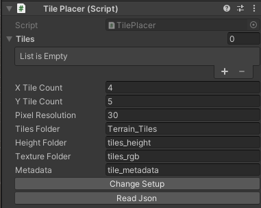
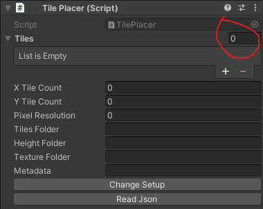

<!--
Quick tip: Right-click this README.md file in VS Code and choose "Open Preview" (or press Ctrl+K V)
for a nicer rendered view.
-->
# Unity: Import Guide for Heightmap & Texture Tiles
## Project Setup
- This project was made with Unity version 2022.3.40f1. You can try a different version it will probably work with it as well.
- This project was created with the Universal 3D Core Template. You can try a different version it shouldn't affect anything idk :D
## Code Setup
- Place the "TilePlacer.cs" file anywhere you want inside of the project.
- Create a folder named Editor and put the "TilePlacerEditor.cs" code inside of it.
## Files Setup
- Create a folder named "Resources".
- Create a folder named "Terrain_Tiles" inside of the "Resources" folder.
- Place the "tiles_height" folder, "tiles_rgb" folder and the "tile_metadata" json file, from the Python outputs, inside of the "Terrain_Tiles" folder.

# Usage of the component

1. Attach the TilePlacer component to a gameobject.
2. Input the correct number of Horizontal and Vertical tile counts.
3. Input the correct pixel resolution of the satelite imagery. (E.g. 30 m/px)
4. Input the names of the previously created folders' names and the metadata json file's name.
    - You can change the names of the folders and the json file as you wish, just make sure to also change them in the component.
5. First, click on the "Read Json" button to create the tiles.
6. Then, click on the "Change Setup" button to align the pieces.
## Tips when using the component
- Don't forget to delete the previously created tile gameobjects from the scene hierarchy and the tile data (generated from the json) from the tiles list inside of the component manually.
- When deleting the tiles from the tiles list inside of the component, you can just change the array size to 0 to instantly delete all of them.

